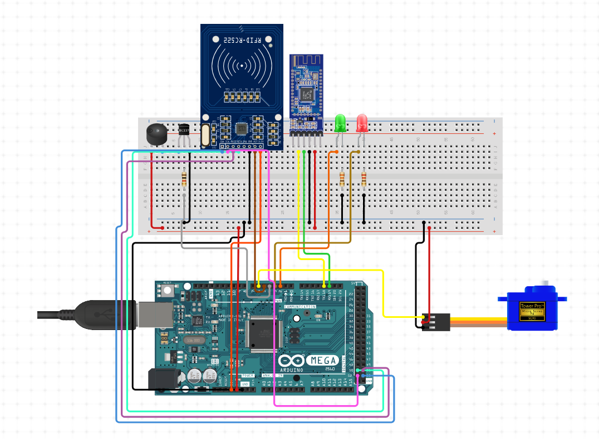

# SafeLock Project

## Overview

**SafeLock** is a smart door lock system designed to enhance home security by utilizing NFC cards and Bluetooth for authentication. This project aims to replace traditional physical locks with a more secure and convenient solution. Users can open the door using pre-registered NFC cards, while an administrative interface accessible via Bluetooth allows for remote management and control.

## Features

- **NFC Authentication:** Users can unlock the door using NFC cards. A green LED indicates a successful attempt, and a red LED indicates a failed attempt.
- **Bluetooth Administration:** Administrators can authenticate via Bluetooth to manage NFC cards and unlock the door remotely.
- **Security Measures:** Limited incorrect attempts, cooldown periods, and re-authentication requirements to prevent brute force attacks.
- **Real-Time Feedback:** LEDs and a buzzer provide visual and auditory feedback on system status and security events.

## Hardware

### Components

- **Arduino Mega 2560:** The main microcontroller board.
- **MFRC522 NFC Reader:** Used for reading NFC cards.
- **Servo Motor:** Simulates the door lock mechanism.
- **LEDs:** Green and red LEDs indicate system status.
- **Buzzer:** Alerts nearby security after multiple failed attempts.
- **HM-10 BLE Bluetooth Module:** Enables Bluetooth communication for administrative functions.

### Specifications

- **Arduino Mega 2560:**
  - CPU: ATmega2560
  - Clock Speed: 16 MHz
  - RAM: 8 KB
  - Flash Memory: 256 KB
  - EEPROM: 4 KB
  - I/O: 54 digital I/O pins, 16 analog inputs, 4 UARTs
- **NFC Reader (MFRC522):**
  - Protocol: SPI
  - Pins Used: SS_PIN (53), RST_PIN (49), IRQ_PIN (3), MOSI (51), MISO (50), SCK (52)
- **Servo Motor:**
  - Controlled via PWM on pin 2
- **LEDs:**
  - Green LED on pin 10
  - Red LED on pin 12
- **Buzzer:**
  - Controlled via pin 7

## Software

### Key Libraries

- **MFRC522 Library:** For interfacing with the NFC reader.
- **Servo Library:** For controlling the servo motor.
- **Countimer Library:** For managing timers.
- **SoftwareSerial and HardwareSerial Libraries:** For Bluetooth communication.

### Real-Time Constraints

The system must promptly detect and respond to NFC card presentations, manage LED blinking durations, handle cooldown periods accurately, and control the servo motor in real-time.

## Test Cases

- **NFC Authentication:**
  - Test successful unlocking with a valid NFC card.
  - Test unsuccessful unlocking with an invalid NFC card.
- **Bluetooth Administration:**
  - Test successful unlocking with the correct passphrase.
  - Test unsuccessful unlocking with an incorrect passphrase.
  - Test adding and removing NFC cards.
- **Security Measures:**
  - Test triggering the alarm after three failed attempts.
- **Indicators:**
  - Test that the green LED lights up on successful unlocking.
  - Test that the red LED flashes on unsuccessful unlocking.

## Team Contributions

This project was a collaborative effort by Mohamed Noureldin, Maya Makram, and Youssef Fares. The team worked together to implement and integrate each component, making decisions on timers, interrupts, and the card management system.

- Mohamed Sherif - https://github.com/MohamedSherifNoureldin
- Maya Makram - https://github.com/mayammakram
- Youssef Fares - 
